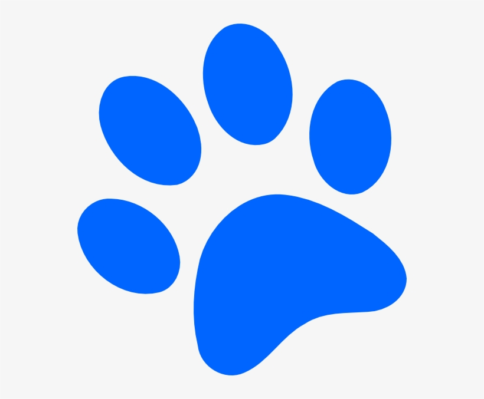

# asyncFun

# async function ( 😎 ) { 😎 } ; expressions and the fetch ( 😎 ) method.

Focus of this project was to learn asynchronous, promise based programming using async function expressions and the fetch() method.
The program is currently linked to js/fetch.js where the fetch() method is used. 
js/async.js is written with async functions with the same outcome as js/fetch.js
The goal was to create a dog library and populate it with data from wikipedia and json data

## Key components

* event listener on button click starts asynchronous function calls
* button text changes to "Loading..." and animated .gif of loader is inserted to page
* List of 445 dog facts and 448 dog names in json format - json/dogFacts.json and json/dognames.json 
* fetch data from wikipedia's API based on list of dog names
* fetch data from json/dogFacts.json
* insert select element and populate option tags with data from json/dognames.json
* loop through facts to pull at random and insert to body of page
* insert the 448 dog profiles from wikipedia and 445 random facts to main element of page

## Resources

wikipedia API
Full Stack JavaScript Track at www.teamtreehouse.com

